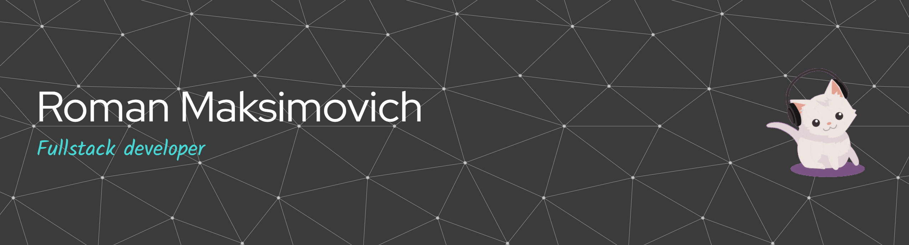

# Welcome! 

My name is **Roman (Horekki)** and I'm a passionate Fullstack Developer crafting modern web applications. I'm based in Minsk, Belarus. You can find me on [![LinkedIn][linkedin-icon]][linkedin-url], [![Telegram][telegram-icon]][telegram-url] or drop me an [![Email][email-icon]][email-url].

[linkedin-icon]: https://img.shields.io/badge/LinkedIn-0A66C2?style=flat&logo=linkedin&logoColor=white
[linkedin-url]: https://www.linkedin.com/in/roman-maksimovich-943562304
[telegram-icon]: https://img.shields.io/badge/Telegram-26A5E4?style=flat&logo=telegram&logoColor=white
[telegram-url]: https://t.me/horekki
[email-icon]: https://img.shields.io/badge/Email-EA4335?style=flat&logo=gmail&logoColor=white
[email-url]: mailto:horrekki@gmail.com

### 💻 About Me

- 🎓 **3rd-year Computer Science student** at BSUIR, transforming theory into practice.
- 🏗️ **Core Stack:** `Java Spring Boot` | `React + Vite` | `Next.js` | `TypeScript`
- 🔍 **My Approach:** I love deconstructing complex solutions to understand the "why" behind them and then building my own, more efficient versions.
- 🎯 **Currently Exploring:** Expanding my frontend horizon with **Vue.js** ecosystem.
- 🏐 **Beyond Code:** Team player on the volleyball court, believer in strategy and coordination.

> **"Talk is cheap. Show me the code."** – Linus Torvalds

- ### 📈 My GitHub Stats

### 🚀 Featured Projects

Here are some of the projects I've built from the ground up:

  
  
  
  

---

  <i>Let's build something amazing together.</i> 
  <i>⚡ Open to internships, collaborations, and cool ideas.</i>

